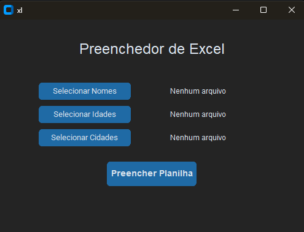

Preenchedor de Excel

Aplicação desktop desenvolvida em Python para gerar automaticamente planilhas Excel a partir de arquivos `.txt`.

---

Sobre o projeto

Este projeto foi criado com o objetivo de automatizar a criação de planilhas Excel a partir de dados simples, eliminando a necessidade de preenchimento manual.

O usuário seleciona três arquivos de texto:

* nomes
* idades
* cidades

E o sistema gera um arquivo .xlsx estruturado automaticamente.

---

Interface

A aplicação possui uma interface gráfica simples e intuitiva, construída com CustomTkinter.

Funcionalidades:

* Seleção de arquivos .txt
* Validação de dados
* Geração automática de planilha Excel
* Abertura automática do arquivo gerado

---

Estrutura dos arquivos de entrada

Cada arquivo .txt deve conter um valor por linha:

nomes.txt

---
João
Maria
Carlos
---

idades.txt

---
20
25
30
---

cidades.txt

---
São Paulo
Rio de Janeiro
Belo Horizonte
---

---

Saída gerada

O programa cria uma planilha Excel com a seguinte estrutura:

| Nome   | Idade | Cidade         |
| ------ | ----- | -------------- |
| João   | 20    | São Paulo      |
| Maria  | 25    | Rio de Janeiro |
| Carlos | 30    | Belo Horizonte |

---

Tecnologias utilizadas

* Python
* Pandas
* CustomTkinter

---

Como executar

1. Clone o repositório
git clone https://github.com/seu-usuario/preenchedor-excel.git

2. Acesse a pasta
cd preenchedor-excel

3. Instale as dependências
pip install pandas customtkinter openpyxl

4. Execute o programa
python main.py

---

Funcionalidades implementadas

✔ Interface gráfica
✔ Leitura de arquivos .txt
✔ Validação de dados
✔ Geração de Excel com `pandas`
✔ Tratamento de erros
✔ Abertura automática do arquivo gerado

---

Licença

Este projeto é de uso livre para fins de estudo e aprimoramento.

---

Autor

Desenvolvido por BeezDev
